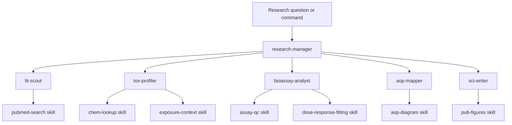
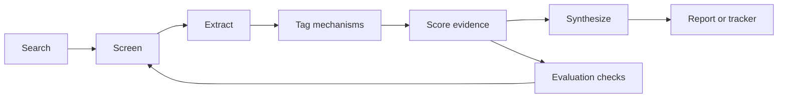

# Agent Architecture

Claude-Minions is organized as an environmental toxicology research platform: one coordinator routes work to specialist agents, and reusable skills provide the runnable scientific tooling.

## Current structure

## Agent responsibilities

| Layer | Component | Responsibility |
|---|---|---|
| Orchestration | `research-manager` | Frames the question, chooses agents/skills, keeps the evidence ledger, applies quality gates, and synthesizes outputs. |
| Literature | `lit-scout` | Builds reproducible searches, screens records, extracts evidence, and saves PRISMA-style logs. |
| Chemical context | `tox-profiler` | Resolves identity, CAS, properties, and toxicology or bioactivity context. |
| Assay analysis | `bioassay-analyst` | Performs plate QC, normalization, and dose-response fitting. |
| Mechanism | `aop-mapper` | Links molecular initiating events to key events and adverse outcomes. |
| Writing | `sci-writer` | Drafts traceable Methods, Results, Discussion, and reports without fabricated claims. |
| Evaluation | `evals/` | Tests agent output against scientist-reviewed benchmarks. |

## Literature workflow

The literature workflow should be treated as a pipeline even when it is implemented inside `lit-scout`:

This separation keeps the system easier to test. Over time, these stages can become their own agents if the workflow becomes too large for `lit-scout`.

## Quality gates

Before evidence is written into a report, tracker, manuscript, or knowledge base, the system should check:

| Gate | Question |
|---|---|
| Relevance | Is this record truly about EDCs, MDCs, metabolic disruption, reproductive toxicity, or the requested endpoint? |
| Directness | Was the nutrient or intervention directly tested, or only mentioned? |
| Evidence category | Is this human, animal, in vitro, review, computational, or ecotoxicology evidence? |
| Citation validity | Do PMID, DOI, title, and link resolve to the same source? |
| Claim support | Is each key finding supported by the abstract/full text available to the agent? |
| Exposure relevance | Are dose, concentration, and realistic human exposure considered where needed? |

## Target evolution

The next structural improvements should be added in this order:

1. **Evaluation first.** Expand `evals/` so every agent can be measured against expert-reviewed examples.
2. **Persistent memory.** Store PMIDs, DOIs, CAS numbers, dedupe keys, corrected classifications, and prior evidence decisions.
3. **Evidence scoring.** Add a consistent confidence scale, with human intervention studies above cohorts, animal studies, in vitro studies, reviews, and computational predictions.
4. **Knowledge graph.** Represent evidence as relationships: chemical -> mechanism -> tissue -> endpoint/disease -> nutrient/intervention -> study.
5. **Research planning.** Let `research-manager` identify evidence gaps and propose follow-up experiments or analyses.

## Design rule

Add new agents only when a responsibility becomes large enough to test independently. Until then, prefer specialist skills and quality gates inside the existing agents.
