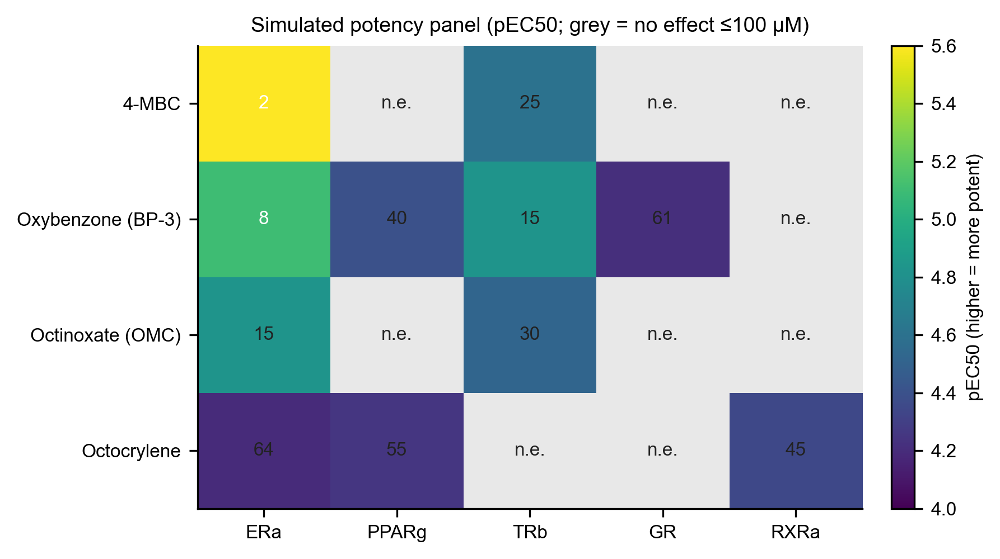
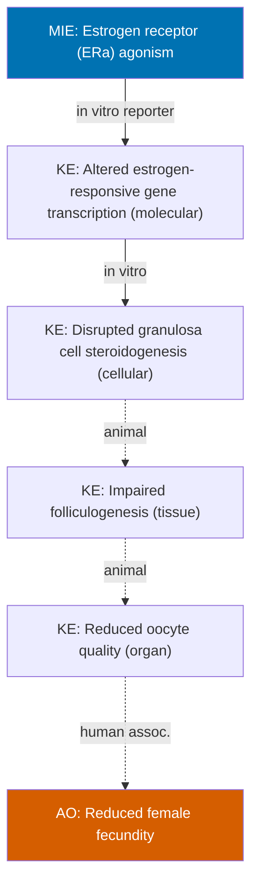

# In vitro endocrine and metabolic activity of four organic UV filters: a screening-level integration of hazard, potency, exposure context, and mechanistic pathways

*Generated with the [Claud-Minions](../../README.md) agent pipeline as a worked demonstration.*

> **Data provenance.** Chemical identity and physicochemical values in Section 3.1 are **real**, retrieved live from PubChem. The dose–response data in Sections 3.2–3.3 are **simulated** for demonstration of the analysis pipeline and must not be cited as experimental findings. The adverse outcome pathway in Section 3.4 is a plausible construct for illustration. Citations are marked `[TK]` (to come) and must be added and verified before any real use.

---

## Abstract

Organic UV filters are high-production-volume ingredients in personal-care products with widespread human exposure and emerging concern as endocrine and **metabolic** disruptors. Here we screen four common filters — 4-methylbenzylidene camphor (4-MBC), oxybenzone (BP-3), octinoxate (OMC) and octocrylene — across a panel of five nuclear-receptor targets spanning reproductive and metabolic axes (ERα, PPARγ, TRβ, GR, RXRα) in reporter-gene assays, place the resulting potencies in the context of human internal exposure via a margin-of-exposure (MOE) calculation, and assemble mechanistic adverse outcome pathways (AOPs) linking (i) ERα agonism to reduced female fecundity and (ii) PPARγ activation to obesity and insulin resistance. Estrogenic potency ranked 4-MBC > BP-3 > OMC > octocrylene (EC50 2.0–63 µM). BP-3 showed the broadest profile, with additional activity at PPARγ, TRβ and GR; the lipophilic octocrylene engaged the metabolic obesogen targets PPARγ and RXRα. All MOEs exceeded 390 against illustrative plasma concentrations, indicating a low screening-level priority on any single endpoint, though multi-target activity, weak partial agonism, and mixture effects warrant further study.

## 1. Introduction

Environmental exposure to endocrine-disrupting chemicals (EDCs) is a recognised risk factor for metabolic and reproductive disorders `[TK]`. A subset of EDCs act as *metabolism-disrupting chemicals* or "obesogens", perturbing nuclear receptors that govern adipogenesis, lipid handling and glucose homeostasis — notably PPARγ, RXRα, the glucocorticoid receptor (GR) and thyroid hormone receptor (TRβ) `[TK]`. Organic UV filters are of particular interest because dermal application leads to systemic absorption and detectable body burdens in the general population `[TK]`. Several filters activate nuclear hormone receptors in vitro, but potency data are heterogeneous, usually confined to a single receptor, and rarely integrated with realistic exposure. This screening study demonstrates an integrated workflow — hazard identification, quantitative potency across a reproductive-and-metabolic receptor panel, exposure contextualisation and mechanistic pathway mapping — for four representative filters.

## 2. Methods

**Chemical identity.** Canonical identifiers and physicochemical properties were retrieved from PubChem (PUG-REST) by CAS registry number (`chem-lookup` skill). XLogP values are computed (predicted), not experimental.

**In vitro estrogenic activity (simulated).** ERα reporter-gene agonist data were generated for an 8-point concentration series (0.03–100 µM, triplicate) with vehicle and positive (reference agonist) controls. Plate quality control — Z′-factor, control coefficient of variation, blank subtraction, outlier detection — and normalisation to the positive-control window were performed with the `assay-qc` skill. Concentration–response data were fitted to a four-parameter logistic (Hill) model with the `dose-response-fitting` skill; plateaus were constrained to 0–100%. EC50 values are reported with 95% confidence intervals and coefficient of determination (R²).

**Metabolic receptor panel (simulated).** Each compound was additionally screened against four metabolism-relevant nuclear receptors — PPARγ, TRβ, GR and RXRα — using the same reporter-gene format, fitting and QC as above. Potencies are summarised as an EC50 matrix and a pEC50 heatmap (`build_panel.py`, which drives the `dose-response-fitting` and `pub-figures` skills). Compound–target combinations without a concentration-dependent response are reported as "no effect up to 100 µM" (n.e.) rather than fitted.

**Exposure context.** Margin of exposure (MOE = EC50 ÷ plasma concentration) was computed with the `exposure-context` skill against **illustrative** human plasma concentrations (order-of-magnitude estimates; replace with biomonitoring values `[TK]`).

**Mechanistic pathway.** An AOP linking the molecular initiating event to the adverse outcome was assembled (`aop-mapper`) and rendered (`aop-diagram`), with each key event relationship annotated by evidence level and confidence.

## 3. Results

### 3.1 Chemical identity and physicochemical properties (real, PubChem)

| Compound | CAS | PubChem CID | Formula | MW (g/mol) | XLogP* | InChIKey |
|---|---|---|---|---|---|---|
| 4-MBC (enzacamene) | 36861-47-9 | 37563 | C18H22O | 254.4 | 4.5 | HEOCBCNFKCOKBX-UHFFFAOYSA-N |
| Oxybenzone (BP-3) | 131-57-7 | 4632 | C14H12O3 | 228.24 | 3.6 | DXGLGDHPHMLXJC-UHFFFAOYSA-N |
| Octinoxate (OMC) | 5466-77-3 | 5355130 | C18H26O3 | 290.4 | 5.3 | YBGZDTIWKVFICR-JLHYYAGUSA-N |
| Octocrylene | 6197-30-4 | 22571 | C24H27NO2 | 361.5 | 7.1 | FMJSMJQBSVNSBF-UHFFFAOYSA-N |

*\*XLogP is a computed value. Increasing lipophilicity (3.6 → 7.1) is consistent with greater bioaccumulation potential for octocrylene `[TK]`.*

### 3.2 In vitro estrogenic activity (simulated)

All plates passed QC (Z′ ≥ 0.84; control CV < 10%). Estrogenic potency ranked **4-MBC > BP-3 > OMC > octocrylene**.

| Compound | Z′ | EC50 (µM) | 95% CI | Hill slope | R² | Fit note |
|---|---|---|---|---|---|---|
| 4-MBC | 0.89 | 2.04 | 1.86–2.21 | 1.24 | 0.997 | full curve |
| Oxybenzone (BP-3) | 0.90 | 7.88 | 6.90–8.86 | 1.10 | 0.997 | full curve |
| Octinoxate (OMC) | 0.84 | 15.09 | 11.34–18.85 | 1.01 | 0.993 | **plateau not reached — EC50 extrapolated** |
| Octocrylene | 0.93 | 62.60 | 5.39–119.82 | 0.85 | 0.992 | **plateau not reached; wide CI — treat as a lower bound** |

Fitted curves: [4-MBC](out/fit_mbc_curve.png) · [BP-3](out/fit_bp3_curve.png) · [OMC](out/fit_omc_curve.png) · [octocrylene](out/fit_oc_curve.png).

The wide confidence interval and shallow Hill slope for octocrylene reflect weak, non-plateauing agonism over the tested range; its EC50 should be interpreted as an approximate lower bound rather than a defined potency.

### 3.3 Metabolic receptor panel (simulated)

Extending beyond ERα, the four filters were screened across a reproductive-and-metabolic receptor panel. Potencies (EC50, µM; "n.e." = no effect up to 100 µM) are shown below and as a heatmap in **Figure 1** ([out/panel_heatmap.png](out/panel_heatmap.png)).

| Compound | ERα | PPARγ | TRβ | GR | RXRα |
|---|---|---|---|---|---|
| 4-MBC | 2.0 | n.e. | 24.9 | n.e. | n.e. |
| Oxybenzone (BP-3) | 7.9 | 40.0 | 14.9 | 60.6 | n.e. |
| Octinoxate (OMC) | 14.9 | n.e. | 29.9 | n.e. | n.e. |
| Octocrylene | 63.7 | 55.4 | n.e. | n.e. | 45.1 |

*Exact fitted values (with CIs and R²) are in the machine-readable `out/panel_ec50_matrix.csv`.*



*Figure 1. Simulated potency (pEC50 = −log10 EC50[M]; brighter = more potent) across the receptor panel. Grey cells denote no effect up to 100 µM.*

Two patterns emerge. **BP-3 has the broadest profile**, engaging four of five targets including the metabolic receptors PPARγ, TRβ and GR — consistent with a promiscuous, low-potency EDC. **The most lipophilic filter, octocrylene**, is a weak estrogen but engages the adipogenic obesogen targets PPARγ and RXRα, the receptor pair activated by classic obesogens `[TK]`. TRβ activity (relevant to thyroid-mediated metabolic control) was detected for three of four filters. These metabolic-axis hits, absent from an ERα-only screen, are the basis for the PPARγ pathway in Section 3.5.

### 3.4 Exposure context

| Compound | EC50 (µM) | Illustrative plasma (nM) | MOE | Screening band |
|---|---|---|---|---|
| 4-MBC | 2.04 | 5 | 407 | Lower priority |
| Oxybenzone (BP-3) | 7.88 | 20 | 394 | Lower priority |
| Octinoxate (OMC) | 15.09 | 3 | 5031 | Lower priority |
| Octocrylene | 62.60 | 8 | 7826 | Lower priority |

On this single endpoint, all MOEs exceed 390 — in vitro ERα agonism occurs at concentrations two to four orders of magnitude above the illustrative internal exposures. This is a screening-level triage, not a risk assessment (see Limitations).

### 3.5 Adverse outcome pathway — reproductive axis (ERα → fecundity)



*Edge style encodes weight of evidence: solid = strong, dashed = moderate, dotted = weak. A static image is available at [out/aop_er_reproduction.png](out/aop_er_reproduction.png).* The in vitro EC50s in Section 3.2 provide evidence that these filters can trigger the molecular initiating event (ERα agonism); the downstream key event relationships toward reduced fecundity carry decreasing evidentiary support, and the final link to the human adverse outcome is weak and associative only.

### 3.6 Adverse outcome pathway — metabolic axis (PPARγ → obesity/insulin resistance)

The PPARγ and RXRα hits in Section 3.3 (BP-3, octocrylene) motivate a second, metabolic pathway. PPARγ is the master transcriptional regulator of adipogenesis and the canonical obesogen target; its activation drives preadipocyte differentiation and lipid accumulation, and chronic engagement is linked to adipose expansion, adipokine dysregulation and insulin resistance.

```mermaid
flowchart TD
    MIE["MIE: PPARgamma activation"]
    KE1["KE: Altered adipogenic gene transcription (molecular)"]
    KE2["KE: Preadipocyte-to-adipocyte differentiation (cellular)"]
    KE3["KE: Increased lipid accumulation (cellular)"]
    KE4["KE: White adipose tissue expansion (tissue)"]
    KE5["KE: Impaired insulin signalling / adipokine dysregulation (organ)"]
    AO["AO: Obesity and insulin resistance"]

    MIE -->|in vitro reporter| KE1
    KE1 -->|in vitro| KE2
    KE2 -->|in vitro (HCA)| KE3
    KE3 -.->|animal| KE4
    KE4 -.->|animal + human| KE5
    KE5 -.->|human assoc.| AO

    style MIE fill:#0072B2,color:#fff
    style AO fill:#D55E00,color:#fff
```

*Static image: [out/aop_pparg_metabolic.png](out/aop_pparg_metabolic.png).* The early key events (transcription → differentiation → lipid accumulation) are well supported by in vitro adipogenesis assays, including high-content lipid imaging (`assay-qc` + high-content analysis); the organism-level links to clinical obesity and insulin resistance rest on animal and associative human data and are weaker `[TK]`.

## 4. Discussion

The four filters span roughly a 30-fold range in simulated ERα potency, with the camphor derivative 4-MBC the most potent and the highly lipophilic octocrylene the weakest agonist. Ranking by estrogenic potency alone, however, can mislead. First, the metabolic panel (Section 3.3) reveals activity an ERα-only screen would miss: BP-3 is a promiscuous low-potency ligand hitting PPARγ, TRβ and GR, while octocrylene — the weakest estrogen — is precisely the compound that engages the adipogenic obesogen pair PPARγ/RXRα. A chemical that looks benign on the reproductive axis can therefore carry metabolic-disruption liability. Second, octocrylene's high logP (7.1) predicts greater bioaccumulation `[TK]`, which no single potency value captures, and the MOE analysis reframes all endpoints as low priority at current illustrative exposures. Integrating potency across multiple targets with exposure and lipophilicity — rather than relying on any single axis — is therefore essential to avoid both false alarms and missed hazards. Real evaluation would additionally require mixture effects (co-exposure to multiple filters), anti-androgenic and steroidogenesis (aromatase) endpoints, functional adipogenesis/glucose-uptake assays downstream of the receptor hits, and measured biomonitoring data.

## 5. Limitations

- **The dose–response data are simulated** and included only to demonstrate the analysis pipeline; they are not experimental evidence.
- Exposure values are illustrative order-of-magnitude placeholders; MOEs will change with real biomonitoring data `[TK]`.
- Nominal in vitro concentrations may exceed free (bioavailable) concentrations; this and full in vitro–in vivo extrapolation (e.g. `httk`) are not accounted for.
- Receptor activation (transactivation) does not distinguish agonism from antagonism, nor confirm downstream functional consequences; the panel hits require confirmation in functional assays (e.g. adipocyte differentiation, glucose uptake, T3-dependent readouts).
- Anti-androgenic and steroidogenesis (aromatase) endpoints, and receptor cross-talk, were not assessed.
- AOP key event relationships beyond the MIE are illustrative and require literature substantiation `[TK]`.

## Data availability

Input plate data (`plate_*.csv`), the panel builder (`build_panel.py`), the AOP definitions (`aop_er_reproduction.json`, `aop_pparg_metabolic.json`), and all pipeline outputs (`out/`, including `panel_ec50_matrix.csv` and `panel_heatmap.png`) accompany this report and reproduce every table and figure above.

## References

Citations are pending and marked `[TK]` throughout. No references were fabricated. Use the `lit-scout` agent to populate this section with verified, retrieved sources.
